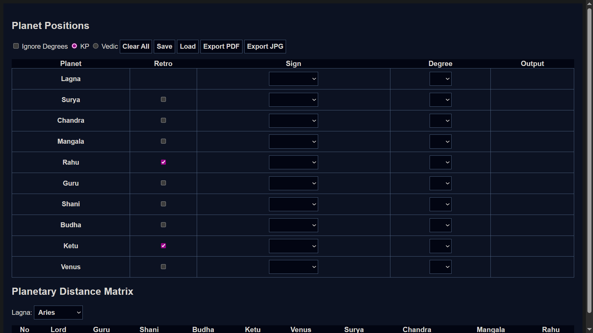
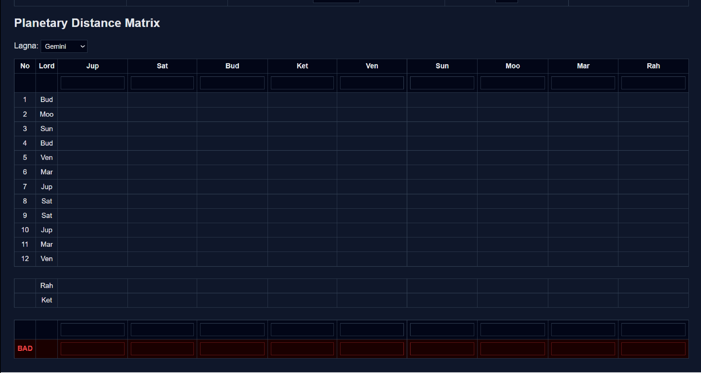

# Orbital Dynamics Analyzer

A browser-based analytical tool for studying relative positions, directional movement, and distance relationships between multiple entities arranged across a 12-segment circular system.

This project is fully client-side, requires no installation, and runs entirely in modern web browsers.

---

## 🌐 Live Application

👉 https://donniedarsshan.github.io/orbital-dynamics-analyzer/

---

## 📸 Screenshots

### Main Interface

### Relation Matrix & Notes

---

## 🎯 Purpose of This Tool

The Orbital Dynamics Analyzer is designed to simplify complex positional calculations that involve:

- Circular motion divided into 12 equal segments
- Forward and reverse movement handling
- Relative distance computation between entities
- Multiple calculation systems with instant recalculation

It serves as a **thinking aid and analysis utility**, helping users avoid repetitive manual calculations.

---

## ✨ Key Features

### 1. Interactive Position Input
- Segment (sign) selection
- Degree-based precision input (0–29)
- Optional **Ignore Degrees** mode for high-level analysis
- Retrograde toggle for reverse movement simulation

---

### 2. Dual Calculation Systems
- **KP system**
- **Vedic system**

Switching systems instantly recalculates all outputs without reloading the page.

---

### 3. Automatic Output Generation
- Absolute position mapping (0°–360°)
- Relative offset calculation from a reference point
- Dynamic house/segment number determination

---

### 4. Relational Distance Matrix
- Automatically generated multi-row matrix
- Handles direct, reverse, and special-node relationships
- Clean separation of calculation rows and interpretation notes

---

### 5. Notes & Classification Rows
- Free-text note rows for interpretations
- Highlighted **BAD** row for critical observations
- Notes persist when saving and loading sessions

---

### 6. Save & Load
- Export full chart state as a `.json` file
- Reload charts instantly without re-entry
- Ideal for long or repeated analysis sessions

---

### 7. Export Options
- Export complete chart as **PDF**
- Export complete chart as **JPG image**
- High-resolution export with dark theme preserved

---

### 8. Privacy First
- No backend
- No cookies
- No tracking
- No analytics
- All data remains on the user’s device

---

## 🧠 How It Works (High Level)

1. Each entity is converted into an absolute circular position
2. Relative differences are computed against reference points
3. Directional logic is applied for forward or reverse movement
4. Results are mapped back into 12-segment outputs
5. The matrix updates dynamically on every input change

All calculations are deterministic and transparent.

---

## 🛠️ Technology Stack

- HTML5
- CSS3 (Dark UI)
- Vanilla JavaScript
- `html2canvas`
- `jsPDF`

No frameworks. No build step.

---

## 🚀 Usage

1. Open the live application
2. Enter positions and degrees
3. Choose calculation system
4. Review outputs and relation matrix
5. Add notes if required
6. Save, export, or reload as needed

---

## 📄 License

This project is licensed under the **MIT License**.

You are free to:
- Use
- Modify
- Distribute

**Credit to the original author must be preserved.**

---

## 📌 Final Note

Although the core design is mathematical and positional in nature, this tool can also be used for **kundali / horoscope analysis** and related interpretive workflows.

The application itself remains neutral and calculation-focused.

---

## 👤 Author

**Donnie Darsshan**
